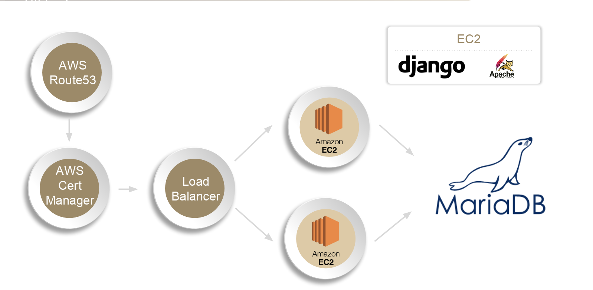
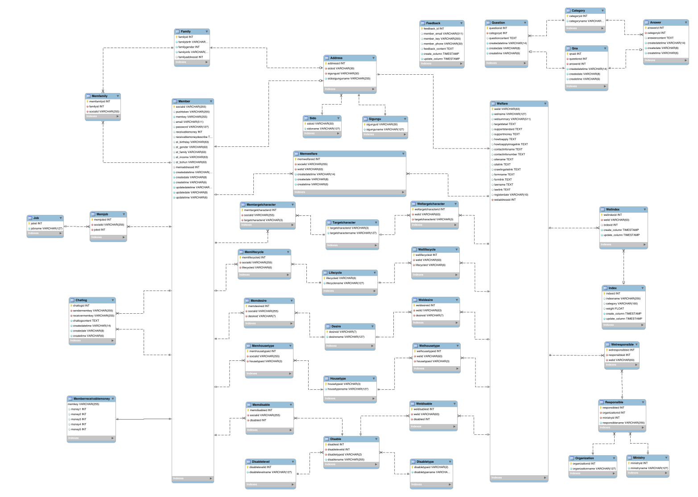

# SWMaestro 10기 "돌아가는 세상" Django 서버 코드

### 1. 개요

</img>
* * *
</img>


### 2. aws 구성

</img>

### 3. 환경 설정


##### 깃에서 프로젝트를 다운받은 후 프로젝트 폴더로 이동
```
cd /path/to/p1040_chatbot
```

* * *

##### 파이썬 프로젝트들 끼리의 패키 버전 충돌을 방지하기위해 가상의 파이썬 환경을 설정
```
virtualenv venv
```

* * *


##### 가상환경의 파이썬으로 환경변수를 일시적으로 변경
```
source /path/to/p1040_chatbot/venv/bin/activate
```

* * *

##### 프로젝트를 실행하는데에 필요한 패키지들을 설치
```
pip install -r requirements.txt
```

* * *

##### 프로젝트 내부의 hoxymetoo 폴더로 이동
```
cd /path/to/p1040_chatbot/hoxymetoo
```

* * *

##### 아파치에서 각종 css파일등을 찾을 수 있도록하기 위해 설정
```
mkdir static
cd /path/to/p1040_chatbot

python manage.py collectstatic
```

* * *

##### 보안을 위해 key들은 직접 관리 (db연결 환경설정 & db 암호화에대한 키 값) 
```
vim key.py

--------------in key.py------------

mysql_conf = {
    'ENGINE': 'django.db.backends.mysql',
    'NAME': '데이터베이스 이름',
    'USER': '데이터베이스 유저',
    'PASSWORD': '유저의 비밀번호',
    'HOST': '서버 주소',
    'PORT': '3306',
    'OPTIONS': {
        'init_command': "SET sql_mode='STRICT_TRANS_TABLES'",
    },
}

aes_key = ''
###################################################
```

* * *

##### 서버 작동
```
sudo systemctl restart httpd
```

##### disable에 대한 데이터들을 넣기 위해 아래의 주소로 요청

```
wget https://hoxymetoo.com/create-disable
```


### 3. Database EER Image

</img>